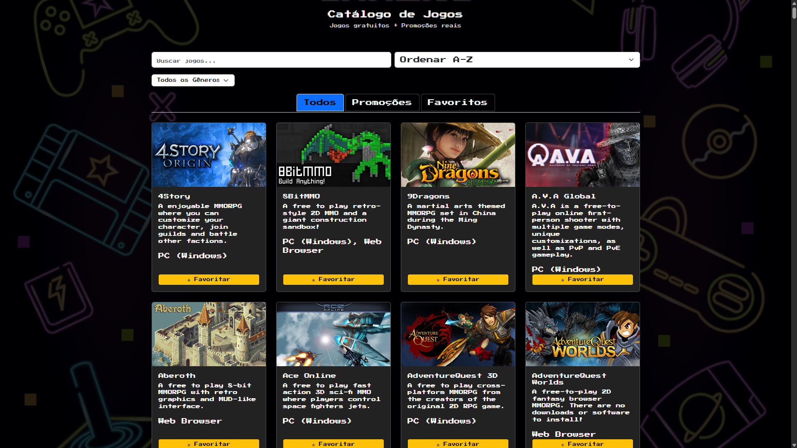

# 🎮 Catálogo de Jogos

Aplicação web responsiva que lista jogos gratuitos e promoções reais fazendo buscas em lojas oficiais como a Steam.



## 🧰 Tecnologias utilizadas

- HTML5, CSS3 (mobile-first)
- JavaScript (ES6+)
- [FreeToGame API](https://www.freetogame.com/) - Para catalogar jogos.
- [CheapShark API](https://www.cheapshark.com/) - Para inclusão dos preços.
- Bootstrap 5
- Google Fonts

## 🔎 Funcionalidades

- ✅ Listagem de jogos gratuitos por gênero
- ✅ Promoções com preços reais e loja (Steam, etc.)
- ✅ Busca por título
- ✅ Ordenação alfabética (A-Z / Z-A)
- ✅ Favoritar jogos com `localStorage`
- ✅ Filtros por gênero e loja
- ✅ Layout responsivo e tema gamer

## 📦 Como executar o projeto

1. Clone o repositório:
```bash
git clone https://github.com/seu-usuario/nome-do-repo.git
```
2. Abra com Live Server no VSCode.
